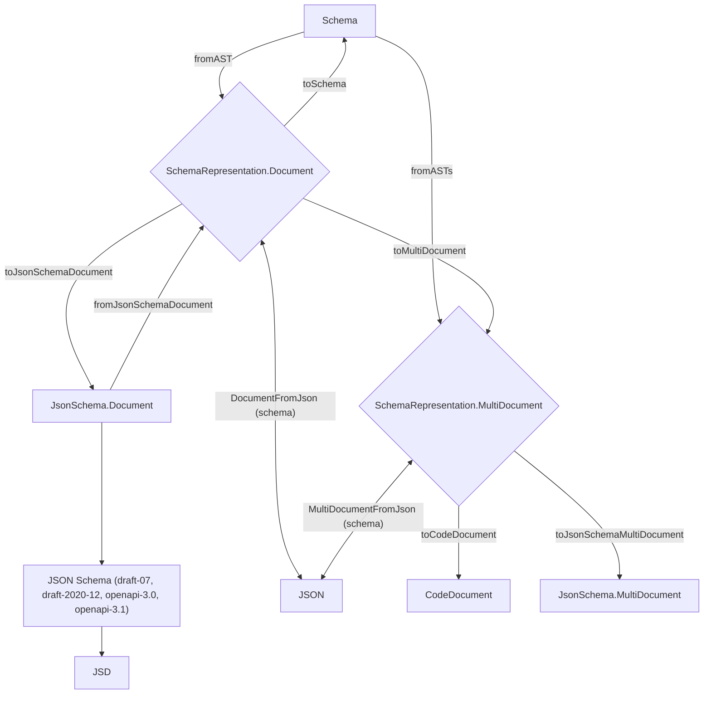

<!--
Vendored from the Effect canonical Schema guide (effect-smol, packages/effect/SCHEMA.md, main branch).
Reference material for the effect-v4-schema skill. Tracks upstream main, which may run AHEAD of the
pinned effect@4.0.0-beta.93 in this repo. Verify any specific API against the installed package before
relying on it (node --input-type=module -e "import * as S from 'effect/Schema'; console.log(typeof S.X)").
Source: https://github.com/Effect-TS/effect-smol/blob/main/packages/effect/SCHEMA.md
-->

# Schema Representation

The `SchemaRepresentation` module converts a `Schema` into a portable data structure and back again.

Use it when you need to:

- store schemas on disk (for example in a cache)
- send schemas over the network
- rebuild runtime schemas later
- convert to JSON Schema (Draft 2020-12)
- generate TypeScript code that recreates schemas

At a high level:

- `fromAST` / `fromASTs` turn a schema AST into a `Document` / `MultiDocument`
- `DocumentFromJson` (schema) round-trip that document through JSON
- `toSchema` rebuilds a runtime `Schema` from the stored representation
- `toJsonSchemaDocument` produces a Draft 2020-12 JSON Schema document
- `toCodeDocument` prepares data for code generation (via `toMultiDocument`)



## The data model

### `Representation`

A `Representation` is a tagged object tree (`_tag` fields like `"String"`, `"Objects"`, `"Union"`, ...). It describes the _structure_ of a schema in a JSON-friendly way.

Only a subset of schema features can be represented. See "Limitations" below.

### `Document`

A `Document` has:

- `representation`: the root `Representation`
- `references`: a map of named definitions used by the root representation

References let the representation share definitions and support recursion.

### `MultiDocument`

A `MultiDocument` stores multiple root representations that share the same `references` table.

This is useful if you want to serialize a set of schemas together, or if you want to generate code for multiple schemas while emitting shared definitions only once.

## Limitations

`SchemaRepresentation` is meant for schemas that can be described without user code.

That has a few consequences.

### Transformations are not supported

The representation format describes the schema's _shape_ and a set of known checks. It does not store transformation logic.

Schemas that rely on transformations cannot be round-tripped, including:

- `Schema.transform(...)`
- `Schema.encodeTo(...)`
- custom codecs or any schema that changes how values are encoded/decoded

If you serialize a transformed schema, the transformation logic will be lost. When you rebuild it with `toSchema`, you will only get the structural schema.

> **Aside** (Why transformations are excluded)
>
> A transformation is user code (functions). JSON cannot store functions, and serializing functions as strings would not be safe or portable.

### Only built-in checks can be represented

Checks are stored as `Filter` / `FilterGroup` nodes with a small `meta` object.

Only checks that match the built-in meta definitions are supported, such as:

- string checks: `isMinLength`, `isPattern`, `isUUID`, ...
- number checks: `isInt`, `isBetween`, `isMultipleOf`, ...
- bigint checks: `isGreaterThanBigInt`, ...
- array checks: `isLength`, `isUnique`, ...
- object checks: `isMinProperties`, ...
- date checks: `isBetweenDate`, ...

Custom predicates (for example `Schema.filter((x) => ...)`) are not supported, because the representation has nowhere to store the function.

### Annotations are filtered

Annotations are stored as a record, but:

- only values that look like JSON primitives (plus `bigint` and `symbol` in the in-memory form) are kept
- some annotation keys are dropped using an internal blacklist

In practice, documentation annotations like `title` and `description` are preserved, while complex values (functions, instances, nested objects) are ignored.

### Declarations need a reviver

Some runtime schemas are represented as `Declaration` nodes. Rebuilding them requires a "reviver" function.

`toSchema` ships with a default reviver (`toSchemaDefaultReviver`) that recognizes a fixed set of constructors, including:

- `effect/Option`, `effect/Result`, `effect/Exit`, ...
- `ReadonlyMap`, `ReadonlySet`
- `RegExp`, `URL`, `Date`
- `FormData`, `URLSearchParams`, `Uint8Array`
- `DateTime.Utc`, `effect/Duration`

If your document contains other declarations, pass a custom `reviver` to `toSchema`.

## JSON round-tripping

### `toJson` / `fromJson`

- `toJson(document)` returns JSON-compatible data (safe to `JSON.stringify`)
- `fromJson(unknown)` validates and parses JSON data back into a `Document`

Internally, these functions use a canonical JSON codec for `Document$`. This is why values like `bigint` in annotations are encoded as strings in the JSON form and restored on decode.

## Rebuilding runtime schemas

### `toSchema`

`toSchema(document)` walks the representation tree and recreates a runtime schema.

What it does:

- rebuilds the structural schema nodes (`Struct`, `Tuple`, `Union`, ...)
- resolves references from `document.references`
- supports recursive references using `Schema.suspend`
- re-attaches stored annotations via `.annotate(...)` and `.annotateKey(...)`
- re-applies supported checks via `.check(...)`

If you need custom handling for declarations:

```ts
SchemaRepresentation.toSchema(document, {
  reviver: (declaration, recur) => {
    // Return a runtime schema to override how a Declaration is rebuilt.
    // Return undefined to fall back to the default behavior.
    return undefined
  }
})
```

## JSON Schema output

### `toJsonSchemaDocument` / `toJsonSchemaMultiDocument`

These functions convert a `Document` or `MultiDocument` into a Draft 2020-12 JSON Schema document.

This is useful for tooling that expects JSON Schema, or for producing OpenAPI-compatible schema pieces (depending on your pipeline).

## Code generation

### `toCodeDocument`

`toCodeDocument` converts a `MultiDocument` into a structure that is convenient for generating TypeScript source.

It:

- sorts references so non-recursive definitions can be emitted in dependency order
- keeps recursive definitions separate (they must be emitted using `Schema.suspend`)
- sanitizes reference names into valid JavaScript identifiers
- collects extra artifacts that must be emitted (enums, symbols, imports)

You can customize:

- `sanitizeReference` to control how `$ref` strings become identifiers
- `reviver` to generate custom code for `Declaration` nodes
