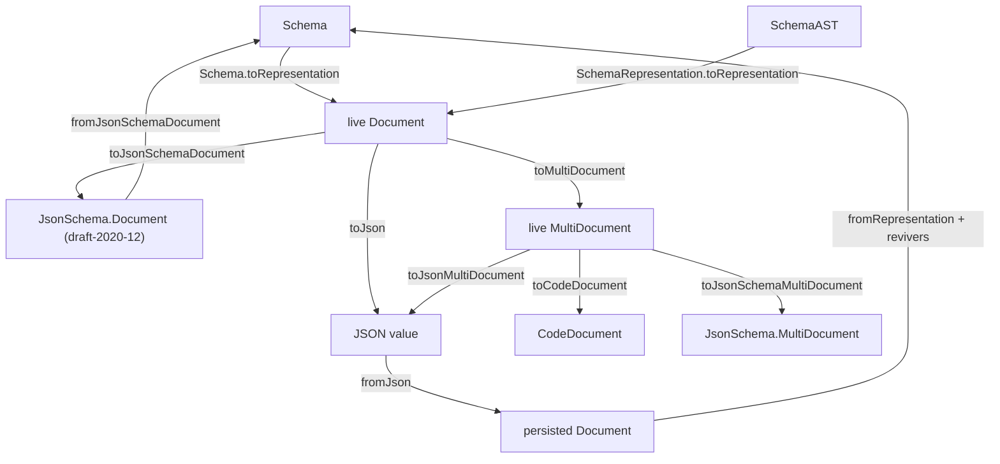

<!--
Vendored from the Effect canonical Schema guide (Effect-TS/effect, packages/effect/SCHEMA.md, main branch).
Reference material for the effect-v4-schema skill. Tracks upstream main, which may run AHEAD of the
pinned effect v4 beta in this repo. Verify any specific API against the installed package before
relying on it (node --input-type=module -e "import * as S from 'effect/Schema'; console.log(typeof S.X)").
Source: https://github.com/Effect-TS/effect/blob/main/packages/effect/SCHEMA.md

REWRITTEN against effect@4.0.0-beta.107 source; every code block in the new text typechecks. The
previous version documented an API that does not exist at this pin — `SchemaRepresentation.fromAST`,
`fromASTs`, `toSchema`, `toSchemaDefaultReviver`, `DocumentFromJson` and `MultiDocumentFromJson` are all
`undefined`. The real surface is `Schema.toRepresentation` / `SchemaRepresentation.toRepresentation`
(+ `toRepresentations`), `toJson` / `fromJson`, `fromRepresentation` / `fromRepresentations` with
explicit revivers, and `toJsonSchemaDocument` / `toCodeDocument`. NOT PROBED: the code-generation and
JSON Schema compilation output blobs.
-->

# Schema Representation

> **Beta trap.** This section was rewritten against `4.0.0-beta.107` source. The
> previous version described an API that is not reachable: `SchemaRepresentation.fromAST`,
> `fromASTs`, `toSchema` and `toSchemaDefaultReviver` do not exist in any form.
> `DocumentFromJson` and `MultiDocumentFromJson` do exist in the source — but as
> module-private `const`s that implement `toJson`/`fromJson`, never exported, so
> they resolve in neither value nor type space for a consumer. Grepping the
> source finds them and can make this correction look wrong; it is not. The real
> entry points are
> `Schema.toRepresentation` / `SchemaRepresentation.toRepresentation` (and
> `toRepresentations`), `toJson` / `fromJson` for the persistence boundary, and
> `fromRepresentation` / `fromRepresentations` with explicit revivers built by
> `makeDeclarationReviver` / `makeFilterReviver` / `makeFilterGroupReviver`.
> The old text also claimed transformations and custom checks simply cannot be
> represented; that closed set is gone — a custom declaration or check is
> persistable once it carries a representation identity and the consumer supplies
> a matching reviver.


The `SchemaRepresentation` module exposes the structural form used to inspect, persist, compile, and rebuild schemas.

A representation is always a projection of one side of a schema. By default, `Schema.toRepresentation` and
`SchemaRepresentation.toRepresentation` project the encoded side. Apply `Schema.toType` or `SchemaAST.toType` first when
you need the decoded type side instead.

Use it when you need to:

- inspect the structural form of a schema
- store schemas on disk or send them over the network
- rebuild runtime schemas with an explicit set of revivers
- compile live representations to JSON Schema Draft 2020-12
- generate TypeScript code from live representations

At a high level:

- `Schema.toRepresentation(schema)` converts a schema to a `Document`
- `SchemaRepresentation.toRepresentation(ast)` and `toRepresentations(asts)` convert schema ASTs to a `Document` or
  `MultiDocument`
- `toJson` / `fromJson` cross the persistence boundary
- `fromRepresentation` / `fromRepresentations` rebuild runtime schemas using explicit revivers
- `toJsonSchemaDocument` compiles a live `Document` to JSON Schema Draft 2020-12
- `toCodeDocument` compiles a live `MultiDocument` to runtime and TypeScript source fragments


```mermaid
flowchart TD
    S[Schema] -->|Schema.toRepresentation|LD["live Document"]
    AST[SchemaAST] -->|SchemaRepresentation.toRepresentation|LD
    LD -->|toJson|JSON["JSON value"]
    JSON -->|fromJson|PD["persisted Document"]
    PD -->|"fromRepresentation + revivers"|S
    LD -->|toJsonSchemaDocument|JD["JsonSchema.Document (draft-2020-12)"]
    JD -->|fromJsonSchemaDocument|S
    LD -->|toMultiDocument|LMD["live MultiDocument"]
    LMD -->|toCodeDocument|CodeDocument
    LMD -->|toJsonSchemaMultiDocument|JMD[JsonSchema.MultiDocument]
    LMD -->|toJsonMultiDocument|JSON
```

## The data model

### `Representation`

A `Representation` is a tagged object tree (`_tag` fields like `"String"`, `"Objects"`, `"Union"`, ...). It describes one
structural side of a schema. Named or recursive nodes use `Reference` values instead of duplicating their definitions.

### `Document`

A `Document` has:

- `representation`: the root `Representation`
- `references`: a map of named definitions used by the root representation

References let the representation share definitions and support recursion.

### `MultiDocument`

A `MultiDocument` stores multiple root representations that share the same `references` table.

This is useful if you want to serialize a set of schemas together, or if you want to generate code for multiple schemas while emitting shared definitions only once.

## Projection and persistence boundaries

### Representations use the encoded side

`toRepresentation` follows a schema's encoding chain and represents its last encoded side. It does not serialize the
transformation functions.

```ts
import { Schema } from "effect"

const encoded = Schema.toRepresentation(Schema.NumberFromString)
console.log(encoded.representation._tag)
// "String"

const decoded = Schema.toRepresentation(Schema.toType(Schema.NumberFromString))
console.log(decoded.representation._tag)
// "Number"
```

Consequently, rebuilding `encoded` produces a schema for the string representation; it does not recreate the original
string-to-number transformation.

### Live and persisted documents

A live `Document` can contain functions in its ordinary annotations. These callbacks allow compilers to handle custom
behavior:

- a check can provide `toJsonSchema`
- a declaration or check can provide `toCode`

Functions cannot cross the JSON persistence boundary. `toJson` removes them and keeps only JSON-valued ordinary
annotations. Nested JSON arrays and objects are preserved; a complete annotation value is omitted when it contains a
function, `undefined`, `bigint`, a symbol, a cycle, or another non-JSON value.

Structural values such as bigint literals and registered unique symbols have dedicated canonical encodings. That does not
make bigint or symbol values valid generic annotations.

### Persistence identities

Opaque declarations and checks need a stable identity before they can be persisted:

```ts
interface RepresentationAnnotation {
  readonly id: string
  readonly payload: Schema.Json
}

interface CheckRepresentationAnnotation<S> extends RepresentationAnnotation {
  readonly schemas?: ReadonlyArray<S>
}
```

`id` selects a reviver, `payload` contains its JSON configuration, and a check can use `schemas` for schema dependencies.
This replaces the previous closed set of check metadata. Custom declarations and checks are therefore persistable when
they provide a representation identity and the consumer provides a matching reviver.

An unannotated custom declaration or leaf filter can still exist in a live representation, but `toJson` rejects it because
there is no portable way to reconstruct its user code.

## Creating representations

Use `Schema.toRepresentation` when starting from a schema:

```ts
import { Schema } from "effect"

const document = Schema.toRepresentation(
  Schema.Struct({ name: Schema.NonEmptyString })
)
```

Use the lower-level functions when working directly with ASTs or several roots:

```ts
import { Schema, SchemaRepresentation } from "effect"

const document = SchemaRepresentation.toRepresentation(Schema.String.ast)

const multiDocument = SchemaRepresentation.toRepresentations([
  Schema.String.ast,
  Schema.Number.ast
])
```

Repeated structural nodes, identifiers, and recursive schemas are placed in `references`. Repeated `Suspend` and
`Declaration` nodes are reference candidates as well. For unions, enums, template literals, and string literals, the
converter uses an inexpensive size estimate and creates an anonymous reference only when it expects the reference to be
smaller than repeating the body. `toMultiDocument(document)` wraps a single document when a compiler requires multiple
roots.

An explicit `identifier` requests a reference name within a conversion. Reusing the same schema shares its reference.
Context-only copies created through `SchemaAST.replaceContext` retain the original AST as their reference owner, including
across several successive context changes. Context still belongs to each occurrence and does not, by itself, make a node a
reference candidate. Independently constructed ASTs are not canonicalized merely because their other fields contain the
same references. When distinct schemas request the same name, the first schema keeps it and later schemas receive numeric
suffixes in encounter order, such as `Value_1` and `Value_2`. Internal `~identifier` annotations are fallback allocation
hints; their generated names use the `Encoded` suffix and follow the same collision rules.

## JSON persistence

### `toJson` / `fromJson`

`toJson(document)` projects and validates a live document, then returns a `Schema.Json` value suitable for storage or
transport. `fromJson(input)` validates persisted JSON and returns a `Document`; it does not restore runtime callbacks.

The multi-root equivalents are `toJsonMultiDocument` and `fromJsonMultiDocument`.

```ts
import { Schema, SchemaRepresentation } from "effect"

const live = Schema.toRepresentation(
  Schema.String.check(Schema.isMinLength(3))
)

const json = SchemaRepresentation.toJson(live)
const persisted = SchemaRepresentation.fromJson(json)
```

Persisted `Declaration` and `Filter` nodes must contain a representation identity. `fromJson` validates the document but
does not require the corresponding revivers until reconstruction.

## Rebuilding runtime schemas

### `fromRepresentation`

`fromRepresentation` rebuilds structural nodes, resolves references, restores recursion, reattaches annotations, and
reapplies checks. Revivers are resolved by `id`; none are installed implicitly, so the `revivers` array is required even
when it is empty.

```ts
import { Schema, SchemaRepresentation } from "effect"

const json = SchemaRepresentation.toJson(
  Schema.toRepresentation(
    Schema.String.check(Schema.isMinLength(3))
  )
)

const document = SchemaRepresentation.fromJson(json)
const rebuilt = SchemaRepresentation.fromRepresentation(document, {
  revivers: [Schema.isMinLengthReviver]
})

console.log(Schema.is(rebuilt)("abc"))
// true
console.log(Schema.is(rebuilt)("a"))
// false
```

Effect exports individual revivers next to the built-in declarations and checks they reconstruct, such as
`Schema.OptionReviver`, `Schema.DateReviver`, and `Schema.isMinLengthReviver`. Supply every reviver required by the
document; a missing or duplicate `id`, or a payload that does not satisfy its reviver's `payloadSchema`, is an error.

`fromRepresentations` rebuilds the ordered roots of a `MultiDocument` in a shared reference environment. Only references
reachable from those roots are revived.

### Custom revivers

There are separate reviver contracts for opaque declarations, leaf filters, and opaque filter groups:

- `DeclarationReviver<P>`
- `FilterReviver<P>`
- `FilterGroupReviver<P>`

Use `makeDeclarationReviver`, `makeFilterReviver`, and `makeFilterGroupReviver` to infer `P` from `payloadSchema`.

```ts
import { Schema, SchemaRepresentation } from "effect"

const id = "acme/schema/minLength"

function minLength(
  minimum: number,
  annotations?: Schema.Annotations.Filter
) {
  return Schema.makeFilter<string>((value) => value.length >= minimum, {
    ...annotations,
    representation: { id, payload: { minimum } }
  })
}

const minLengthReviver = SchemaRepresentation.makeFilterReviver(
  id,
  Schema.Struct({ minimum: Schema.Number }),
  ({ annotations, payload }) => minLength(payload.minimum, annotations)
)
```

The same reviver can then be included in the `revivers` array passed to `fromRepresentation` or
`fromRepresentations`.

## JSON Schema

### Exporting JSON Schema

For a runtime schema, prefer `Schema.toJsonSchemaDocument(schema)`. It first derives the schema's canonical JSON codec,
then compiles its encoded representation to JSON Schema Draft 2020-12. During this high-level conversion, declarations
are not extracted into anonymous references: their JSON Schema body is unconstrained, and leaving it inline preserves
empty-schema simplifications. Explicit and recursive references are unaffected.

At the lower level, `SchemaRepresentation.toJsonSchemaDocument(document)` compiles a live `Document`, and
`toJsonSchemaMultiDocument` compiles a live `MultiDocument`. Check-level `toJsonSchema` callbacks contribute JSON Schema
constraints. Opaque declarations that have not been structurally lowered compile to an unconstrained JSON Schema.

`toJsonSchema` callbacks must treat their input schemas as immutable and return a valid JSON Schema object graph. After a
callback returns, it must not mutate that object or anything reachable from it; returning a new graph is the supported way
to produce different output during a later compilation. The compiler may cache structural comparisons while
deduplicating completed definitions, so mutating a previously returned graph can make equality results stale.

Definitions are compared only with definitions in the same internal fallback-identifier group. Equal definitions in
different groups and definitions with explicit identifiers remain distinct. After compilation, local `#/$defs/...`
references are rewritten to the surviving definition, including references returned directly by callbacks. External
references and other local JSON Pointers remain unchanged.

Because compiler callbacks are not persisted, compile the live document before calling `toJson`, or rebuild and lower the
schema with revivers first.

### Importing JSON Schema

`SchemaRepresentation.fromJsonSchemaDocument` imports a JSON Schema Draft 2020-12 document as a runtime `Schema.Top`.
It does not return a representation document.

`fromJsonSchemaMultiDocument` returns the ordered root schemas. It translates only definitions reachable from those
roots. To pass the result to a representation compiler, call `toRepresentations` with the returned schemas' ASTs.

Import is best-effort: JSON Schema constructs are translated to Effect schemas where possible, but the result is not a
lossless reconstruction of an original Effect schema. The optional `onEnter` callback can normalize each JSON Schema node
before it is translated.

Regular expression constraints reached during best-effort translation are rejected by default because imported patterns
use the runtime's native regular expression engine and may block validation for an unbounded amount of time. Set
`patterns: "apply"` only for trusted documents. Set `patterns: "ignore"` to skip reached pattern constraints explicitly;
the resulting schema accepts values that the source document may reject. The policy includes `pattern`, the keys of
`patternProperties`, and patterns nested in `propertyNames`. Ignoring `patternProperties` also skips its value constraints
and `additionalProperties`, because matching keys cannot be determined without evaluating the patterns.

## Code generation

### `toCodeDocument`

`toCodeDocument` compiles a live `MultiDocument` into runtime and TypeScript source fragments. It:

- returns one `Code` value for each root
- sorts non-recursive references in dependency order
- keeps recursive references separate so callers can emit `Schema.suspend`
- sanitizes reference names into valid JavaScript identifiers
- collects symbol, enum, and import artifacts

Opaque declarations and checks provide code through their `toCode` callbacks. `toCodeDocument` does not accept a
reviver option. To generate code from persisted JSON, first reconstruct the schemas with `fromRepresentation` or
`fromRepresentations`, then create a new live representation so the revivers can restore the callbacks.
