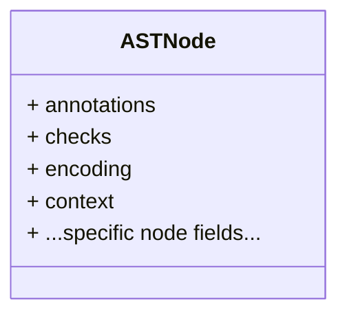
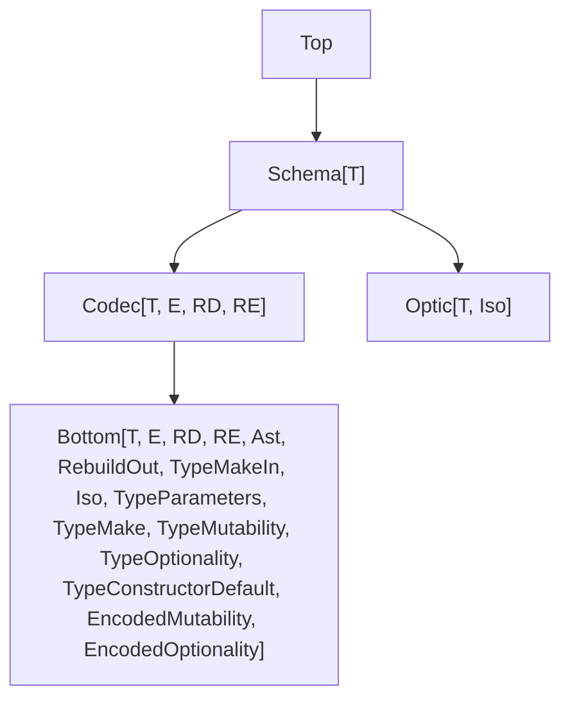

<!--
Vendored from the Effect canonical Schema guide (effect-smol, packages/effect/SCHEMA.md, main branch).
Reference material for the effect-v4-schema skill. Tracks upstream main, which may run AHEAD of the
pinned effect v4 beta in this repo. Verify any specific API against the installed package before
relying on it (node --input-type=module -e "import * as S from 'effect/Schema'; console.log(typeof S.X)").
Source: https://github.com/Effect-TS/effect-smol/blob/main/packages/effect/SCHEMA.md
-->

# Advanced Topics

This section covers Schema's internal type machinery and advanced features. You don't need this to use Schema — it's here for library authors and advanced users who want to understand or extend the type system.

## Model

A "schema" is a strongly typed wrapper around an untyped AST (abstract syntax tree) node.

The base interface is `Bottom`, which sits at the bottom of the schema type hierarchy. In Schema v4, the number of tracked type parameters has increased to 15, allowing for more precise and flexible schema definitions.

```ts
export interface Bottom<
  out T,
  out E,
  out RD,
  out RE,
  out Ast extends AST.AST,
  out RebuildOut extends Top,
  out TypeMakeIn = T,
  out Iso = T,
  in out TypeParameters extends ReadonlyArray<Top> = readonly [],
  out TypeMake = TypeMakeIn,
  out TypeMutability extends Mutability = "readonly",
  out TypeOptionality extends Optionality = "required",
  out TypeConstructorDefault extends ConstructorDefault = "no-default",
  out EncodedMutability extends Mutability = "readonly",
  out EncodedOptionality extends Optionality = "required"
> extends Pipeable.Pipeable {
  readonly [TypeId]: typeof TypeId

  readonly ast: Ast
  readonly "Rebuild": RebuildOut
  readonly "~type.parameters": TypeParameters

  readonly Type: T
  readonly Encoded: E
  readonly DecodingServices: RD
  readonly EncodingServices: RE

  readonly "~type.make.in": TypeMakeIn
  readonly "~type.make": TypeMake // useful to type the `refine` interface
  readonly "~type.constructor.default": TypeConstructorDefault
  readonly Iso: Iso

  readonly "~type.mutability": TypeMutability
  readonly "~type.optionality": TypeOptionality
  readonly "~encoded.mutability": EncodedMutability
  readonly "~encoded.optionality": EncodedOptionality

  annotate(annotations: Annotations.Bottom<this["Type"], this["~type.parameters"]>): this["Rebuild"]
  annotateKey(annotations: Annotations.Key<this["Type"]>): this["Rebuild"]
  check(...checks: readonly [AST.Check<this["Type"]>, ...Array<AST.Check<this["Type"]>>]): this["Rebuild"]
  rebuild(ast: this["ast"]): this["Rebuild"]
  /**
   * @throws {Error} The issue is contained in the error cause.
   */
  make(input: this["~type.make.in"], options?: MakeOptions): this["Type"]
}
```

### Parameter Overview

- `T`: the decoded output type
- `E`: the encoded representation
- `RD`: the type of the services required for decoding
- `RE`: the type of the services required for encoding
- `Ast`: the AST node type
- `RebuildOut`: the type returned when modifying the schema (namely when you add annotations or checks)
- `TypeMakeIn`: the type of the input to the `make` constructor
- `Iso`: the type of the focus of the default `Optic.Iso`
- `TypeParameters`: the type of the type parameters

Contextual information about the schema (when the schema is used in a composite schema such as a struct or a tuple):

- `TypeMake`: the type used to construct the value
- `TypeReadonly`: whether the schema is readonly on the type side
- `TypeIsOptional`: whether the schema is optional on the type side
- `TypeDefault`: whether the constructor has a default value
- `EncodedIsReadonly`: whether the schema is readonly on the encoded side
- `EncodedIsOptional`: whether the schema is optional on the encoded side

### AST Node Structure

Every schema is based on an AST node with a consistent internal shape:



- `annotations`: metadata attached to the schema node
- `checks`: an array of validation rules
- `encoding`: a list of transformations that describe how to encode the value
- `context`: includes details used when the schema appears inside composite schemas such as structs or tuples (e.g., whether the field is optional or mutable)

## Type Hierarchy

The `Bottom` type is the foundation of the schema system. It carries all internal type parameters used by the library.

Higher-level schema types build on this base by narrowing those parameters. Common derived types include:

- `Top`: a generic schema with no fixed shape
- `Schema<T>`: represents the TypeScript type `T`
- `Codec<T, E, RD, RE>`: a schema that decodes `E` to `T` and encodes `T` to `E`, possibly requiring services `RD` and `RE`



### Best Practices

Use `Top`, `Schema`, and `Codec` as _constraints_ only. Do not use them as explicit annotations or return types.

**Example** (Prefer constraints over wide annotations)

```ts
import { Schema } from "effect"

// ✅ Use as a constraint. S can be any schema that extends Top.
declare function foo<S extends Schema.Top>(schema: S)

// ❌ Do not return Codec directly. It erases useful type information.
declare function bar(): Schema.Codec<number, string>

// ❌ Avoid wide annotations that lose details baked into a specific schema.
const schema: Schema.Codec<number, string> = Schema.FiniteFromString
```

These wide types reset other internal parameters to defaults, which removes useful information:

- `Top`: all type parameters are set to defaults
- `Schema`: all type parameters except `Type` are set to defaults
- `Codec`: all type parameters except `Type`, `Encoded`, `DecodingServices`, `EncodingServices` are set to defaults

**Example** (How wide annotations erase information)

```ts
import { Schema } from "effect"

// Read a hidden type-level property from a concrete schema
type TypeMutability = (typeof Schema.FiniteFromString)["~type.mutability"] // "readonly"

const schema: Schema.Codec<number, string> = Schema.FiniteFromString

// After widening to Codec<...>, the mutability info is broadened
type TypeMutability2 = (typeof schema)["~type.mutability"] // "readonly" | "mutable"
```

## Typed Annotations

You can retrieve typed annotations with the `Schema.resolveAnnotations` function. The function is called "resolve" rather than "get" because it performs a lookup: if the schema has checks, the annotations are taken from the last check; otherwise they are taken from the base schema instance. This means annotations placed on a check (e.g. via `.check(myCheck.annotate({ ... }))`) take precedence over annotations on the schema itself.

**Example** (Resolving annotations from a base schema)

```ts
import { Schema } from "effect"

const schema = Schema.String.annotate({ title: "my string" })

console.log(Schema.resolveAnnotations(schema))
// Output: { title: "my string" }
```

**Example** (Annotations on the last check take precedence)

```ts
import { Schema } from "effect"

const schema = Schema.String
  .annotate({ title: "base" })
  .check(Schema.isNonEmpty().annotate({ title: "from check" }))

console.log(Schema.resolveAnnotations(schema)?.title)
// Output: "from check"
```

You can also extend the available annotations by adding your own in a module declaration file.

**Example** (Adding a custom annotation for versioning)

```ts
import { Schema } from "effect"

// Extend the Annotations interface with a custom `version` annotation
declare module "effect/Schema" {
  namespace Annotations {
    interface Augment {
      readonly version?: readonly [major: number, minor: number, patch: number] | undefined
    }
  }
}

// The `version` annotation is now recognized by the TypeScript compiler
const schema = Schema.String.annotate({ version: [1, 2, 0] })

// const version: readonly [major: number, minor: number, patch: number] | undefined
const version = Schema.resolveAnnotations(schema)?.["version"]

if (version) {
  // Access individual parts of the version
  console.log(version[1])
  // Output: 2
}
```

### Key-level Annotations

Key-level annotations are attached via `annotateKey` and apply to a field's position inside a `Struct` or `Tuple` rather than to the field's value type. Use `Schema.resolveAnnotationsKey` to retrieve them.

**Example** (Resolving key-level annotations)

```ts
import { Schema } from "effect"

const schema = Schema.String.annotateKey({ messageMissingKey: "required" })

console.log(Schema.resolveAnnotationsKey(schema))
// Output: { messageMissingKey: "required" }
```

## Generics Improvements

Using generics in schema composition and filters can be difficult.

The plan is to make generics **covariant** and easier to use.

## Separate Requirement Type Parameters

In real-world applications, decoding and encoding often have different dependencies. For example, decoding may require access to a database, while encoding does not.

To support this, schemas now have two separate requirement parameters:

```ts
interface Codec<T, E, RD, RE> {
  // ...
}
```

- `RD`: services required **only for decoding**
- `RE`: services required **only for encoding**

This makes it easier to work with schemas in contexts where one direction has no external dependencies.

**Example** (Decoding requirements are ignored during encoding)

```ts
import type { Effect } from "effect"
import { Context, Schema } from "effect"

// A service that retrieves full user info from an ID
class UserDatabase extends Context.Service<
  UserDatabase,
  {
    getUserById: (id: string) => Effect.Effect<{ readonly id: string; readonly name: string }>
  }
>()("UserDatabase") {}

// Schema that decodes from an ID to a user object using the database,
// but encodes just the ID
declare const User: Schema.Codec<
  { id: string; name: string },
  string,
  UserDatabase, // Decoding requires the database
  never // Encoding does not require any services
>

//     ┌─── Effect<{ readonly id: string; readonly name: string; }, Schema.SchemaError, UserDatabase>
//     ▼
const decoding = Schema.decodeEffect(User)("user-123")

//     ┌─── Effect<string, Schema.SchemaError, never>
//     ▼
const encoding = Schema.encodeEffect(User)({ id: "user-123", name: "John Doe" })
```
